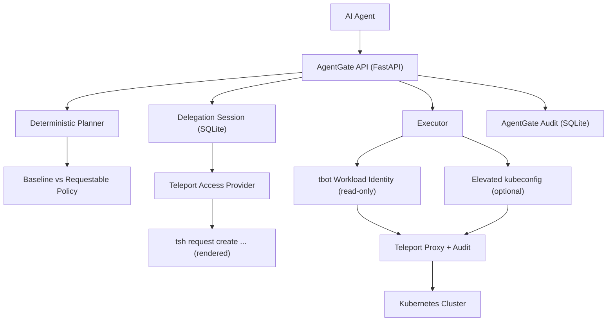

# AgentGate

**AgentGate prototypes Teleport-style delegated agent access:**
**the agent starts with a read-only workload identity, requests time-bound elevation for risky actions,**
**and records both the human delegator and the agent in the audit trail.**

This repo is a lightweight FastAPI + SQLite prototype that mirrors Teleport's current public primitives (Workload Identity, Access Requests, audit events). It does **not** claim any future delegation-cert features already exist.

## What's Real vs Simulated

**Real today (Teleport primitives):**
- Workload Identity (`tbot`) for a read-only bot identity
- Access Requests (role requests in OSS, resource requests in Enterprise)
- Kubernetes proxy + audit events in Teleport
- Standard Kubernetes RBAC for least-privilege

**Simulated locally (prototype glue):**
- Delegation Sessions (AgentGate model that ties tasks + delegators + Teleport requests)
- Rendering `tsh request create ...` commands instead of calling Teleport APIs
- Optional mock approval flow when no Teleport is available

## Architecture



## Delegation Sessions (Core Concept)

A **Delegation Session** is the primary trust boundary:
- **Read-only tasks**: run with the bot's baseline identity.
- **Write/remediation tasks**: require an **approved, time-bound** delegation session.

Each session ties together:
- human delegator
- agent identity
- task
- requested scope
- Teleport access request command/id (if provided)

## Policy Model

Agent policies are split into two buckets:
- **baseline actions** (allowed with read-only identity)
- **requestable actions** (require delegation)

Default policy for `agent-demo`:
- baseline: `read_pods`, `read_logs`, `describe_deployment`
- requestable: `restart_deployment`

You can override via `AGENTGATE_AGENT_POLICY` (JSON) or the legacy `AGENTGATE_AGENT_ALLOWLIST`.

## Quickstart (Mock Mode)

```bash
python3 -m venv .venv
source .venv/bin/activate
pip install -r agentgate/requirements.txt

export AGENTGATE_USE_MOCK_EXECUTOR=true
export AGENTGATE_ACCESS_PROVIDER=mock

uvicorn agentgate.app.main:app --reload --app-dir /Users/sivagirish/Documents/Work/Project/AgentGate
```

```bash
python agentgate/scripts/run_agent.py --environment staging
```

## Teleport-Backed Demo (Role Requests / OSS-shaped)

**Goal:** read-only bot identity + role request for remediation.

1) Start Teleport and Kubernetes service.
2) Apply RBAC and Teleport roles (examples below).
3) Run `tbot` using a **short-lived join token** (no static secrets).
4) Start AgentGate.

Required env:
```bash
export AGENTGATE_TBOT_KUBECONFIG=/Users/sivagirish/Documents/Work/Project/AgentGate/.tbot-output/kubeconfig.yaml
export AGENTGATE_ACCESS_PROVIDER=command
export AGENTGATE_TELEPORT_REQUEST_MODE=role
export AGENTGATE_TELEPORT_REQUEST_ROLE=agentgate-remediator
```

**Elevated execution (optional but honest):**
```bash
export AGENTGATE_ELEVATED_KUBECONFIG=/path/to/elevated/kubeconfig
```
If this is not set, write actions will fail transparently (unless mock mode is enabled).

## Enterprise-Shaped Demo (Resource Requests)

Set:
```bash
export AGENTGATE_TELEPORT_REQUEST_MODE=resource
export AGENTGATE_TELEPORT_CLUSTER=agentgate-local
export AGENTGATE_TELEPORT_KUBE_CLUSTER=kind-agentgate
```

AgentGate will derive resource IDs like:
```
/agentgate-local/kube:ns:deployments.apps/kind-agentgate/prod/website
```
and render a resource access request command.

## Example API Flow

```bash
# 1) Create task
curl -s -X POST http://127.0.0.1:8000/tasks \
  -H 'Content-Type: application/json' \
  -d '{
    "task_id": "demo-1",
    "agent_id": "agent-demo",
    "environment": "staging",
    "natural_language_task": "Restart deployment my-app",
    "delegator_user": "alice",
    "reason": "rollout fix",
    "requested_ttl": "1h"
  }'

# 2) Render access request command
curl -s -X POST http://127.0.0.1:8000/tasks/demo-1/delegation/request

# 3) Execute (write actions will be blocked until approved)
curl -s -X POST http://127.0.0.1:8000/execute/demo-1
```

## Example Teleport Access Request Commands

**Role request (OSS-shaped):**
```
tsh request create --roles="agentgate-remediator" --reason="rollout fix" --ttl="1h"
```

**Resource request (Enterprise-shaped):**
```
tsh request create --resource="/agentgate-local/kube:ns:deployments.apps/kind-agentgate/prod/website" --reason="rollout fix" --ttl="1h"
```

> Note: resource-request CLI flags can vary by Teleport version. AgentGate renders a best-effort command and stores it in the delegation session for audit.

## Examples (Tightened Security Story)

Teleport roles:
- `agentgate/examples/teleport/agentgate-bot-readonly-role.yaml`
- `agentgate/examples/teleport/agentgate-remediator-role.yaml`
- `agentgate/examples/teleport/agentgate-requester-role.yaml`

Kubernetes RBAC:
- `agentgate/examples/kubernetes/agentgate-readonly-rbac.yaml`
- `agentgate/examples/kubernetes/agentgate-remediator-rbac.yaml`

tbot config (no static secrets):
- `agentgate/examples/tbot.yaml`

## Why This Demonstrates Teleport Understanding

- **Workload Identity / tbot** for non-human identity
- **Least privilege** with read-only baseline roles
- **Requestable access** for risky actions
- **Scoped elevation** (role or resource request)
- **Audit + revocation** tied to delegation sessions
- **Kubernetes-first** and lightweight by design

## MCP Note (Stretch)

MCP is a future integration point, not the primary feature here. This prototype focuses on Teleport's current access primitives and audit story.

## Security Cleanup Notes

- No static join tokens are stored in the repo
- No `system:masters` bot role
- No wildcard Kubernetes access

## Repository Layout

```
agentgate/
  app/
    main.py
    config.py
    models.py
    planner.py
    delegation.py
    access_provider.py
    executor.py
    teleport_client.py
    audit.py
    db.py
  scripts/
    run_agent.py
    demo_task.sh
  examples/
    tbot.yaml
    teleport.yaml
    kubernetes/
      agentgate-readonly-rbac.yaml
      agentgate-remediator-rbac.yaml
    teleport/
      agentgate-bot-readonly-role.yaml
      agentgate-remediator-role.yaml
      agentgate-requester-role.yaml
```
