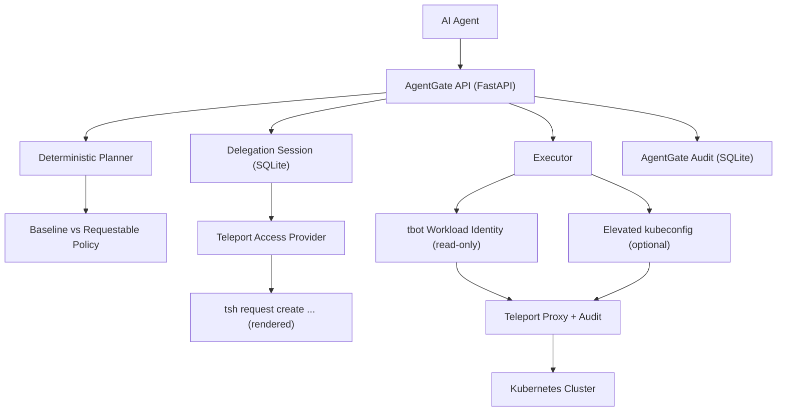

# AgentGate

AgentGate is a lightweight prototype of delegated agent access for Kubernetes built on Teleport's current primitives. It models a read-only workload identity for agents and a time-bound elevation flow for risky actions, while keeping human delegators and agent actions tied together in audit.

This is intentionally not production software. It is a focused, honest prototype meant to demonstrate how Teleport's existing primitives can support agentic delegation patterns.

## Why This Exists

AI agents should not run with standing admin credentials. Teleport already provides the building blocks for non-human identity, access requests, and audit. AgentGate shows how those pieces can be composed into a delegation-session workflow without inventing new Teleport features.

## What's Real vs Simulated

Real today (Teleport primitives):
- Workload Identity via `tbot`
- Access Requests (role requests in OSS, resource requests in Enterprise)
- Kubernetes proxy and audit logging
- Standard Kubernetes RBAC for least privilege

Simulated locally (prototype glue):
- Delegation Session model that binds task + human + agent + request
- Rendering `tsh request create ...` commands instead of calling Teleport APIs
- Optional mock approval for demo/testing

## Architecture



## How The Delegation Flow Works

1. The agent submits a task.
2. The planner generates actions.
3. Baseline actions run with the read-only identity.
4. Requestable actions require a Delegation Session.
5. AgentGate renders a Teleport Access Request command.
6. A human approves the request in Teleport.
7. If an elevated identity is available, write actions execute; otherwise they fail clearly.

## Why This Demonstrates Teleport Understanding

- Uses Workload Identity for non-human access
- Enforces least privilege by default
- Uses Access Requests for time-bound elevation
- Scopes elevation to specific risky actions
- Links human + agent + request in audit
- Keeps the Kubernetes story first-class and minimal

## Quick Demo (5 minutes)

Requirements:
- Teleport running locally
- Kubernetes cluster reachable
- `tbot` configured with a short-lived join token

Start the API:
```bash
uvicorn agentgate.app.main:app --host 127.0.0.1 --port 8000
```

Run the founder demo script:
```bash
AGENTGATE_ACCESS_PROVIDER=command \
AGENTGATE_TELEPORT_REQUEST_MODE=role \
AGENTGATE_TELEPORT_REQUEST_ROLE=agentgate-remediator \
AGENTGATE_TBOT_KUBECONFIG=./.tbot-output/kubeconfig.yaml \
./agentgate/scripts/founder_demo.sh
```

If you want AgentGate to **poll Teleport for approval** (via `tctl`), use the auth API provider and attach the request ID:
```bash
AGENTGATE_ACCESS_PROVIDER=auth_api \
AGENTGATE_TCTL_CONFIG=agentgate/examples/teleport/teleport-oss-local.yaml \
AGENTGATE_TELEPORT_INSECURE=true \
AGENTGATE_TBOT_KUBECONFIG=./.tbot-output/kubeconfig.yaml \
./agentgate/scripts/founder_demo.sh
```
Then attach the request ID after you create it:
```bash
curl -s -X POST http://127.0.0.1:8000/tasks/<task_id>/delegation/attach \
  -H 'Content-Type: application/json' \
  -d '{"teleport_request_id":"<request_id>"}'
```

If you want a fully simulated run:
```bash
AGENTGATE_ACCESS_PROVIDER=mock \
AGENTGATE_USE_MOCK_EXECUTOR=true \
./agentgate/scripts/founder_demo.sh
```

## Security Posture

- Read-only bot identity by default
- No static tokens in repo
- No `system:masters` or wildcard permissions
- Write actions require explicit delegation approval
- Optional elevated execution identity is separate and time-bound

## Current Limitations

- Delegation Sessions are local state, not a Teleport API
- Access requests are rendered, not created programmatically
- Auth API polling requires a request ID attached to the session
- Elevated execution depends on a separate kubeconfig
- This is a Kubernetes-only prototype

## Next Logical Extension

- Optional provider to create and poll real Teleport Access Requests
- Map delegation sessions to Teleport Access Request IDs in audit
- Add scoped resource requests based on live cluster metadata

## Examples

See `agentgate/examples/README.md` for the example files and how to use them safely.

## Demo Notes For Founders

See `docs/demo.md` for a full end-to-end flow and the exact framing to use.

## Tests

```bash
pytest -q
```
