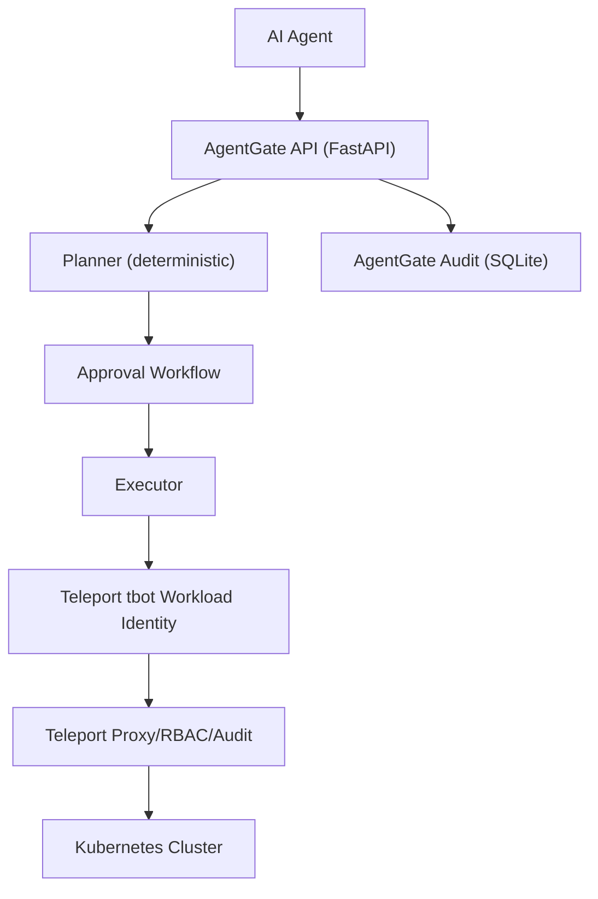

# AgentGate

**AgentGate is a Teleport-backed control plane for AI agents. Teleport provides the identity, access, and audit substrate; AgentGate adds task planning, approval-gated privileged actions, and an agent-centric execution workflow.**

AgentGate is intentionally thin. It treats AI agents as first-class, non-human identities and routes all infrastructure access through Teleport-issued short-lived credentials.

## Highlights

- Teleport-backed identity and access (no static credentials)
- Deterministic action planning for infrastructure tasks
- Approval-gated privileged actions
- High-level, agent-centric audit trail (complementary to Teleport audit)
- Simple, modular FastAPI implementation

## Teleport vs AgentGate

**Teleport provides**
- Non-human identity and Workload Identity
- Short-lived credentials and RBAC
- Infrastructure access proxying
- Low-level audit logging

**AgentGate adds**
- Task intake and deterministic planning
- Approval workflow and guardrails
- Safe execution orchestration
- High-level agent task audit trail

## Architecture



## Repository Layout

```
agentgate/
  app/
    main.py
    config.py
    models.py
    planner.py
    approvals.py
    executor.py
    teleport_client.py
    audit.py
    db.py
  scripts/
    run_agent.py
    demo_task.sh
  examples/
    tbot.yaml
    teleport.yaml
  data/
    agentgate.db
```

## Quickstart (Mock Execution)

```bash
python3 -m venv .venv
source .venv/bin/activate
pip install -r agentgate/requirements.txt

export AGENTGATE_USE_MOCK_EXECUTOR=true
uvicorn agentgate.app.main:app --reload --app-dir /Users/sivagirish/Documents/Work/Project/AgentGate
```

```bash
python agentgate/scripts/run_agent.py --environment staging
```

## Teleport-Backed Setup (Local Dev)

### 1) Start a local Teleport OSS cluster

Use a local config (adjust kubeconfig path to your machine):

```yaml
# teleport-local.yaml
teleport:
  nodename: "agentgate-local"
  data_dir: "./teleport-data"
  log:
    output: stderr
    severity: INFO

auth_service:
  enabled: "yes"
  listen_addr: "127.0.0.1:3025"

proxy_service:
  enabled: "yes"
  listen_addr: "127.0.0.1:3023"
  web_listen_addr: "127.0.0.1:3080"
  kube_listen_addr: "127.0.0.1:3026"
  public_addr: "127.0.0.1:3080"

ssh_service:
  enabled: "no"

kubernetes_service:
  enabled: "yes"
  listen_addr: "127.0.0.1:3027"
  kubeconfig_file: "/Users/sivagirish/.kube/config"
```

Start Teleport:

```bash
teleport start -c teleport-local.yaml
```

### 2) Create a bot role and token

```yaml
# agentgate-bot-role.yaml
kind: role
metadata:
  name: agentgate-bot
spec:
  allow:
    kubernetes_labels:
      "*": "*"
    kubernetes_groups:
      - system:masters
    rules:
      - resources: ["*"]
        verbs: ["*"]
  deny: {}
version: v7
```

```bash
tctl --config teleport-local.yaml create -f agentgate-bot-role.yaml
tctl --config teleport-local.yaml bots add agentgate-bot --roles=agentgate-bot --ttl=1h
```

Put the printed token into `agentgate/examples/tbot.yaml`.

### 3) Start tbot

```bash
tbot start -c agentgate/examples/tbot.yaml --insecure
```

`tbot` will write a short-lived kubeconfig at `./.tbot-output/kubeconfig.yaml`.

### 4) Start AgentGate and point it to Teleport

```bash
export AGENTGATE_TBOT_KUBECONFIG=./.tbot-output/kubeconfig.yaml
uvicorn agentgate.app.main:app --reload --app-dir /Users/sivagirish/Documents/Work/Project/AgentGate
```

## Demo Flow

### Option A: CLI demo

```bash
python agentgate/scripts/run_agent.py \
  --environment staging \
  --task "Investigate high error rate in staging and restart the deployment if necessary."
```

### Option B: curl demo

```bash
curl -X POST http://127.0.0.1:8000/tasks \
  -H "Content-Type: application/json" \
  -d '{
    "task_id": "demo-1",
    "agent_id": "agent-demo",
    "environment": "staging",
    "natural_language_task": "Investigate high error rate in staging and restart the deployment if necessary."
  }'
```

Then approve (if required) and execute:

```bash
curl -X POST http://127.0.0.1:8000/approve/demo-1
curl -X POST http://127.0.0.1:8000/execute/demo-1
curl -X GET http://127.0.0.1:8000/audit
```

## API Endpoints

- `POST /tasks`
- `GET /tasks/{task_id}`
- `POST /approve/{task_id}`
- `POST /reject/{task_id}`
- `POST /execute/{task_id}`
- `GET /audit`
- `GET /health`

## OpenAPI Examples

FastAPI serves interactive docs at `http://127.0.0.1:8000/docs` and raw OpenAPI JSON at `http://127.0.0.1:8000/openapi.json`.

**Create task** (`POST /tasks`)

```json
{
  "task_id": "demo-1",
  "agent_id": "agent-demo",
  "environment": "staging",
  "natural_language_task": "Investigate high error rate in staging and restart the deployment if necessary."
}
```

**Approve** (`POST /approve/{task_id}`)

```json
{
  "task_id": "demo-1",
  "required": true,
  "status": "approved",
  "decided_at": "2026-03-30T18:00:00+00:00"
}
```

**Execute** (`POST /execute/{task_id}`)

```json
{
  "task_id": "demo-1",
  "execution_status": "completed",
  "results": [
    {
      "action": "read_logs",
      "status": "success",
      "summary": "..."
    }
  ]
}
```

**Audit** (`GET /audit`)

```json
[
  {
    "timestamp": "2026-03-30T18:00:00+00:00",
    "task_id": "demo-1",
    "agent_id": "agent-demo",
    "action": "read_logs",
    "environment": "staging",
    "approval_required": true,
    "approval_status": "approved",
    "execution_status": "success",
    "result_summary": "..."
  }
]
```

## Policy Guardrails

AgentGate includes a per-agent allowlist layer to prevent actions outside approved scope. Configure it via the `AGENTGATE_AGENT_ALLOWLIST` environment variable (JSON dictionary of agent IDs to allowed actions). Example:

```bash
export AGENTGATE_AGENT_ALLOWLIST='{"agent-demo":["read_pods","read_logs","describe_deployment","restart_deployment"],"agent-readonly":["read_pods","read_logs","describe_deployment"]}'
```

If a task plan contains an action not in the allowlist, AgentGate rejects the task with a 403 and records a `policy_denied` audit event.

## Teleport Setup Checklist

- Teleport OSS cluster running (auth + proxy)
- Kubernetes service enabled and pointing to your kubeconfig
- Bot role created with Kubernetes access
- Bot token created for workload identity
- `tbot` running and writing a short-lived kubeconfig
- `AGENTGATE_TBOT_KUBECONFIG` points to that kubeconfig

## Why This Matters

AI agents can only be trusted in production when their access is real, short-lived, and auditable. Teleport provides the correct security substrate for non-human identity and infrastructure access. AgentGate builds on that foundation to make agent actions safe, approval-gated, and traceable at the task level.

## CI

GitHub Actions runs a lightweight CI workflow on pull requests to `main` and pushes to `main`. It installs dependencies, compiles modules, and runs tests if present.

## Future Work

- Add richer policy rules (per-agent RBAC overlays)
- Integrate Teleport access review/approval APIs directly
- Expand planner actions and target types
- Stream execution output to audit entries
- Add per-action telemetry and retry controls

## Notes

AgentGate intentionally avoids static credentials or custom auth. It assumes Teleport is the source of truth for identity and access, and it keeps execution strictly routed through Teleport-issued credentials.
